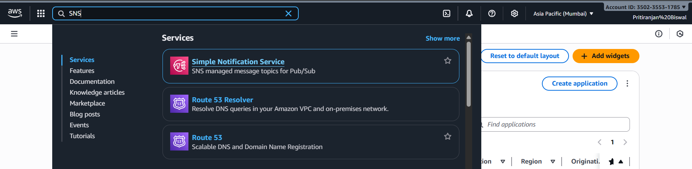
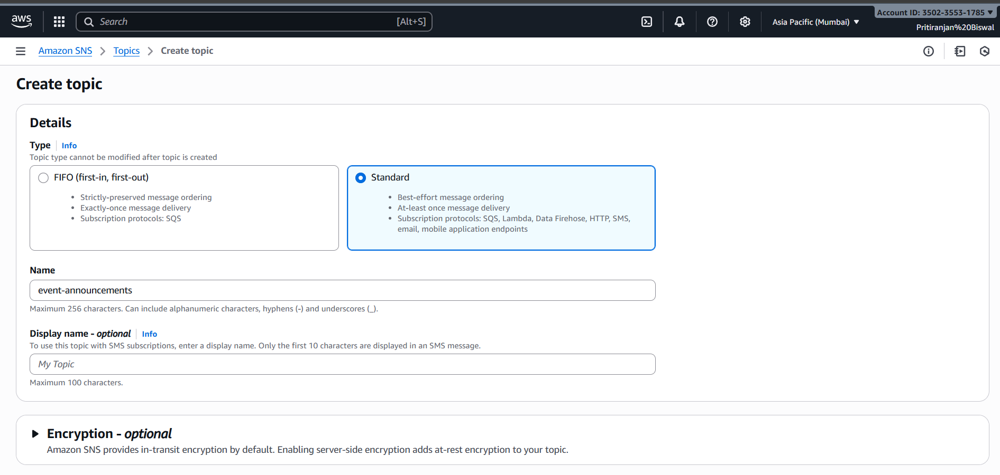
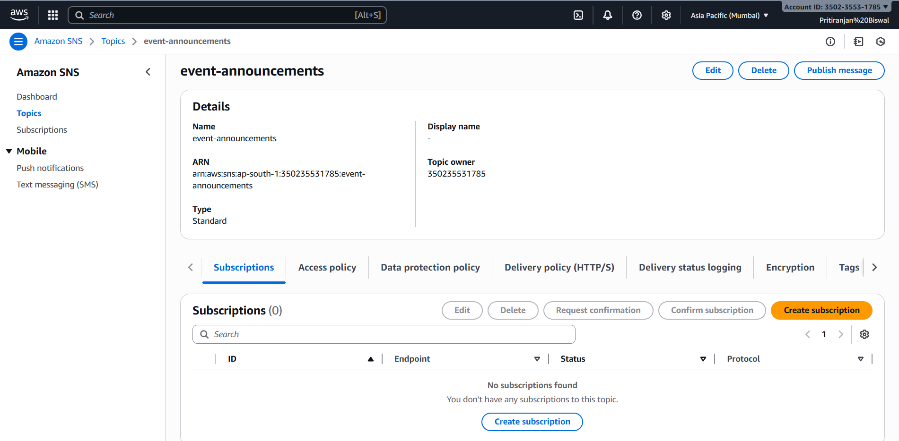
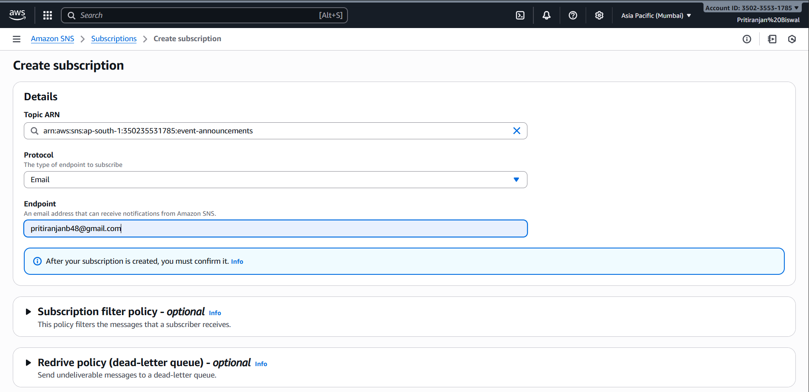

# ⚙️ Detailed Setup: Event Announcement System

This guide explains how to deploy and test the Event Announcement System step-by-step using **AWS Lambda**, **API Gateway**, and **SNS**.

---

## 🧩 AWS Services Used

| Service | Purpose |
|----------|----------|
| **Amazon API Gateway** | Exposes a public REST API endpoint |
| **AWS Lambda** | Executes the backend logic (publishes messages to SNS) |
| **Amazon SNS** | Sends notifications to subscribers |


---

## 🪶 Steps to Build

### 1️⃣ Create SNS Topic
➮. Go to **Amazon SNS → Topics → Create Topic**
  

➮. Choose *Standard*, name it `event-announcements`

  

➮.Create a subscription.

 
 
➮. Choose the **Topic ARN** ,protocol as **Email** and provide the email address you want to notified



---

### 2️⃣ Create Lambda Function
- Go to **AWS Lambda → Create Function**
- Runtime: *Python 3.11*
- Add SNS publish permissions
- Paste your Lambda code


---

### 3️⃣ Create API Gateway
- Create a **REST API**
- Resource: `/publish-event`
- Method: `POST` → Integrate with Lambda
- Add **Mapping Template**:
  ```json
  { "body": $input.body }

### 4️⃣ Test the API with Postman

Once your API Gateway and Lambda are deployed, you can test the integration using Postman.

🔹 Step 1: Open Postman

Choose Method: POST

Paste your Invoke URL

https://<api-id>.execute-api.ap-south-1.amazonaws.com/prod/publish-event

🔹 Step 2: Add Header
Key	Value
Content-Type	application/json
🔹 Step 3: Add Body

Select Body → raw → JSON, and paste this:

{
  "event_name": "AWS DevOps Event",
  "description": "Join our AWS Workshop this Saturday! 📅 Date: 2025-10-25"
}

🔹 Step 4: Send the Request

You should receive a success response:

{
  "message": "Event published successfully!"
}

🔹 Step 5: Verify the Email Notification

Check your registered email inbox — you’ll receive an announcement message from SNS like this:

📢 AWS DevOps Event
Join our AWS Workshop this Saturday!
📅 Date: 2025-10-25
  

